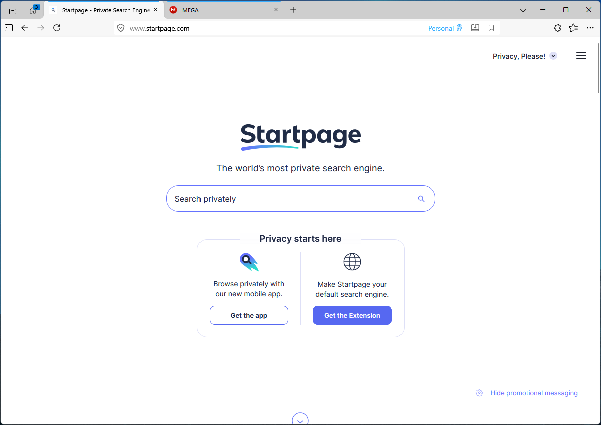

# Workspaces for Firefox

A lightweight workspace manager that organizes your tabs into switchable groups — right from the tab strip.




## Features

- **Tab Workspaces** — Create named workspaces to group related tabs. Switch between them instantly; inactive tabs are hidden, not closed.
- **Keyboard Shortcuts** — `Alt+,` / `Alt+.` to cycle workspaces, `Alt+W` to open the popup.
- **Custom Icons & Colors** — Pick from 32 built-in icons and assign a color to each workspace for quick visual identification.
- **Container Integration** — Optionally bind a workspace to a Firefox Container (Multi-Account Containers). New tabs in that workspace open in the assigned container automatically.
- **Drag & Drop Reorder** — Rearrange workspaces in the popup by dragging.
- **Tab Search** — Quickly find any tab across all workspaces from the popup search bar.
- **Move Tabs via Context Menu** — Right-click any tab → *Move Tab to Another Workspace*.
- **Omnibox** — Type `ws <name>` in the address bar to switch workspaces.
- **Recently Closed Tabs** — View and restore tabs recently closed within each workspace.
- **Tab Previews** — Hover over a workspace to see a tooltip listing its tabs.
- **Theme-Aware UI** — The popup automatically adapts to your Firefox theme (light, dark, or custom LWT), with a manual toggle for system colors.
- **Session Persistence** — Workspaces and their tab assignments survive browser restarts.

## Installation

### From XPI (recommended)

1. Download the latest `.xpi` file from [Releases](#).
2. In Firefox, go to `about:addons` → gear icon → **Install Add-on From File...** → select the `.xpi`.

### From source (development)

```bash
# Install web-ext globally
npm install -g web-ext

# Run in development mode with hot-reload
cd hardfox/extensions/firefox-workspaces
web-ext run --firefox="path/to/firefox"
```

## Placing the Button in the Tab Strip

By default, Workspaces places its toolbar button in the **tab strip** area (next to the tab bar). If it ends up somewhere else after installation, you can move it:

1. **Right-click** on the Firefox toolbar → select **Customize Toolbar...**
2. Find the **Workspaces** button (layered squares icon).
3. **Drag it** to the tab strip — drop it to the left of the first tab, or to the right of the last tab.
4. Click **Done**.

The button shows the icon of your active workspace (or the default icon if none is set), so you can always see which workspace you're in at a glance.

## Usage

| Action | How |
|---|---|
| Open popup | Click the toolbar button or press `Alt+W` |
| Create workspace | Click **New workspace** at the bottom of the popup |
| Switch workspace | Click a workspace name in the popup |
| Next / Previous | `Alt+.` / `Alt+,` |
| Rename workspace | Click the edit (pencil) icon on a workspace row |
| Delete workspace | Click the delete (trash) icon — tabs are closed |
| Assign icon | Click the icon button in the rename/create dialog |
| Assign color | Pick a color swatch in the rename/create dialog |
| Assign container | Select a container from the dropdown in the rename/create dialog |
| Move tab | Right-click a tab → *Move Tab to Another Workspace* → pick target |
| Search tabs | Type in the search bar at the top of the popup |
| Reorder workspaces | Drag and drop workspace rows in the popup |
| Switch via address bar | Type `ws` + `Space` + workspace name |

## Keyboard Shortcuts

| Shortcut | Action |
|---|---|
| `Alt+W` | Open/close the Workspaces popup |
| `Alt+.` | Switch to next workspace |
| `Alt+,` | Switch to previous workspace |

Shortcuts can be customized in `about:addons` → gear icon → **Manage Extension Shortcuts**.

## Permissions

| Permission | Why |
|---|---|
| `tabs` | Query, create, move, and close tabs |
| `tabHide` | Hide tabs belonging to inactive workspaces |
| `tabGroups` | Future tab grouping support |
| `storage` | Persist workspace data across sessions |
| `menus` | "Move Tab to Another Workspace" context menu |
| `sessions` | Tag tabs with workspace IDs for restart recovery |
| `contextualIdentities` | Container integration |
| `cookies` | Required by `contextualIdentities` API |
| `theme` | Detect current theme for adaptive UI colors |

## Project Structure

```
firefox-workspaces/
├── manifest.json
├── backend/
│   ├── brainer.js          # Orchestrator — init & event listener registration
│   ├── workspace.js        # Workspace entity (create, activate, hide, destroy)
│   ├── workspace-service.js # Workspace CRUD, activate/deactivate, containers
│   ├── tab-service.js      # Tab operations, search, closed tabs, sessions
│   ├── ui-service.js       # Toolbar icon, badge, theme detection
│   ├── menu-service.js     # Context menu & omnibox
│   ├── storage.js          # Storage manager (browser.storage.local)
│   └── handler.js          # Message router (popup ↔ background)
├── popup/
│   ├── wsp.html            # Popup markup
│   ├── css/wsp.css         # Theme-aware stylesheet (CSS system colors)
│   └── js/
│       ├── wsp.js          # Popup UI logic
│       ├── dialog.js       # Create/rename dialog
│       ├── tooltip.js      # Tab preview tooltips
│       └── drag-drop.js    # Workspace reordering
└── icons/
    ├── layered-dark.svg    # Toolbar icon (dark theme)
    └── layered-light.svg   # Toolbar icon (light theme)
```

## Building & Signing

```bash
# Package as .xpi for distribution
web-ext build --source-dir=hardfox/extensions/firefox-workspaces

# Sign via AMO (requires API credentials)
# See scripts/sign-workspaces.bat
```

> **Note:** Release Firefox requires signed extensions. Set up AMO API credentials in `.env` and use the provided signing script. Bump the version in `manifest.json` before each submission — AMO rejects duplicate versions.

## Requirements

- Firefox **140** or later
- `tabHide` API enabled (default in Firefox 140+)

## License

MIT
